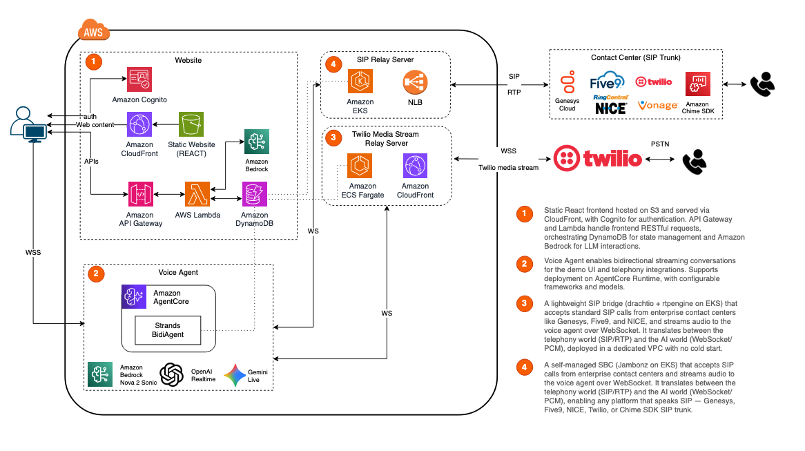

# Conversational AI Agent Studio

Design, build, and deploy production-ready voice AI agents on AWS. A guided studio for configuring real-time speech agents — from industry template to live phone call — powered by Amazon Nova Sonic, Strands Agents BidiAgent, and Amazon Bedrock AgentCore.

## Architecture



The solution has four deployable components. The core app is deployed by the CDK
(`deployment/deploy.sh`); the two telephony paths are deployed independently
because they provision internet-facing network infrastructure subject to a
higher security review bar.

| # | Component | How it's deployed |
|---|-----------|-------------------|
| 1 | **Frontend app** (React UI + demos/tools/RAG API, Cognito) | CDK — `deploy.sh` |
| 2 | **Voice agent on AgentCore** (Nova Sonic BidiAgent runtime) | CDK — `deploy.sh` |
| 3 | **PSTN relay** (Twilio TAC bridge) | Independent — [`telephony/pstn/`](telephony/pstn/) |
| 4 | **SIP relay** (drachtio + bridge) | Independent — [`telephony/sip/`](telephony/sip/) |

## Features

### Agent Builder
- Guided wizard — choose template, pipeline, model, voice, tools, prompt, and workflow
- Industry templates — insurance, banking, contact center training, drive-through, automotive, healthcare
- Visual workflow designer with per-step tool assignment
- Live voice test with real-time transcript

### Speech & Reasoning
- Bidirectional streaming — Nova 2 Sonic, OpenAI Realtime, Gemini Live
- Cascaded pipeline — STT → LLM → TTS with per-stage model selection
- Expert Tool mode — offload reasoning and tool calls from Nova Sonic to Claude/Nova Pro/Qwen3

### Integrations
- Pre-built tools (knowledge base, CRM, calendar, transfer, payment, notifications)
- Custom tools defined in UI with mock responses
- Webhooks, Lambda functions, AgentCore MCP gateways, AgentCore sub-agent runtimes
- RAG via AgentCore Managed Knowledge Base with document upload
- Telephony — PSTN (Twilio) and direct SIP trunk (Genesys, Five9, NICE)

### Platform
- Voice agent deployed on AgentCore Bidirectional Runtime
- Agent dashboard — metrics, conversation history, cost tracking
- Cognito auth with SigV4 presigned WebSocket URLs
- One-command CDK deployment to AWS

## Prerequisites

- AWS CLI v2 configured
- Node.js 18+ and npm
- Python 3.11+ and pip
- AWS CDK v2 (`npm install -g aws-cdk`)
- AWS credentials with permissions for CloudFormation, S3, CloudFront, Cognito, DynamoDB, Lambda, API Gateway, Bedrock, and Bedrock AgentCore
- Amazon Nova 2 Sonic model access enabled in Bedrock console

### Supported Regions

Deploy to **us-east-1** (N. Virginia) for full AgentCore + Nova 2 Sonic support.

## Quick Start

See [docs/DEPLOYMENT.md](docs/DEPLOYMENT.md) for the full deployment guide, CDK stacks, IAM permissions, and environment variables.

`deploy.sh` provisions the core app — components **1 (frontend app)** and
**2 (voice agent on AgentCore)**:

```bash
cd voice-agent-poc-in-a-box
export CDK_INPUT_USER_EMAILS=user1@example.com
cd deployment
bash ./deploy.sh
```

Components **3 (PSTN)** and **4 (SIP)** are optional and deployed independently —
see [`telephony/pstn/`](telephony/pstn/) and [`telephony/sip/`](telephony/sip/).

For local development without full deployment, see [docs/LOCAL-DEVELOPMENT.md](docs/LOCAL-DEVELOPMENT.md).

## Telephony

Real-world voice agents need phone connectivity. The studio provides two telephony paths, letting you test agents over actual phone calls during development and move to production-grade SIP integration for enterprise deployments.

> **Deployed separately from the main CDK app.** Both telephony paths provision
> internet-facing network infrastructure (public load balancers, open UDP ports)
> that is subject to a higher security review bar than the rest of the solution.
> Their source and self-managed deployment instructions live under the top-level
> [`telephony/`](telephony/) folder ([`telephony/pstn/`](telephony/pstn/) and
> [`telephony/sip/`](telephony/sip/)) — they are not created by `deploy.sh`.

### PSTN (Twilio Conversation Relay)

Callers dial a Twilio number and talk to the same voice agent that runs in the browser. Multiple agents can share one phone number with DTMF menu selection.

- **Infrastructure**: ECS Fargate + ALB + CloudFront (HTTPS/WSS only)
- **Network**: Public-only VPC (no private subnets, no NAT Gateway) — Fargate tasks get public IPs directly
- **Media**: Twilio handles all RTP/codec; bridge receives audio as base64 WebSocket messages
- **Security boundary**: CloudFront TLS termination, no open UDP ports

### SIP (Direct Trunk)

Direct SIP integration for enterprise contact centers (Genesys, Five9, NICE) or Twilio SIP Trunking. Lower latency with direct RTP media handling.

- **Infrastructure**: EKS Managed Node Group + NLB (UDP)
- **Network**: Nodes in public subnet with `hostNetwork` — RTP requires direct public IP addressability (NAT Gateway cannot forward inbound UDP)
- **Media**: Self-managed RTP — bridge receives raw UDP packets, converts μ-law 8kHz ↔ PCM 16kHz
- **Security boundary**: Security group (restrict to provider IPs in production), SIP TLS + SRTP recommended

### Why Different Network Designs

| | PSTN Relay | SIP Relay |
|---|---|---|
| VPC | Public subnets only, no NAT | Public + private subnets, NAT for EKS control plane ENIs |
| Inbound protocol | HTTPS/WSS (Twilio manages RTP) | Raw UDP 5060 + 20000-20100 |
| Compute | Fargate (no host access needed) | EKS with hostNetwork (must bind UDP ports on host IP) |
| Load balancer | ALB (HTTP/WebSocket) | NLB (UDP) |
| Public IP exposure | Only via CloudFront | Node's public IP in SDP (directly addressable) |

### Documentation

| Guide | Description |
|-------|-------------|
| [telephony/README.md](telephony/README.md) | Telephony overview — PSTN vs SIP, deployed separately |
| [telephony/pstn/README.md](telephony/pstn/README.md) | PSTN relay source + self-managed deployment instructions |
| [telephony/sip/README.md](telephony/sip/README.md) | SIP relay source + self-managed deployment instructions |
| [GUIDE-pstn-relay-server.md](docs/GUIDE-pstn-relay-server.md) | PSTN relay design, network architecture, and security |
| [GUIDE-sip-server.md](docs/GUIDE-sip-server.md) | SIP server design, network architecture, and production security |
| [SETUP-twilio-sip.md](docs/SETUP-twilio-sip.md) | Twilio SIP Trunk setup (UI + CLI) |
| [GUIDE-genesys-sip-integration.md](docs/GUIDE-genesys-sip-integration.md) | Genesys Cloud CX integration |
| [GUIDE-connect-integration.md](docs/GUIDE-connect-integration.md) | Amazon Connect integration |

## Speech Pipelines

The studio supports two fundamentally different approaches to building voice agents. The wizard lets users choose their pipeline and model, with the UI adapting configuration options accordingly.

### Bidirectional Streaming (Speech-to-Speech)

A single model handles speech input, reasoning, and speech output in one stream. Lowest latency — audio goes in, audio comes out, no intermediate text step required.

| Model | Provider | API Key |
|-------|----------|---------|
| Amazon Nova 2 Sonic | AWS Bedrock | Not needed |
| OpenAI Realtime API | OpenAI | Required |
| Gemini Live | Google AI | Required |

Framework: **Strands BidiAgent** — manages bidirectional WebSocket streaming, tool orchestration, and turn detection.

### Cascaded Pipeline (STT → LLM → TTS)

Separate models for each stage: transcribe speech to text, reason over text, synthesize speech from the response. More flexibility in model choice at each stage — swap STT, LLM, or TTS independently.

| Stage | Options |
|-------|---------|
| STT | Amazon Transcribe, Deepgram |
| LLM | Amazon Nova Lite, Nova Pro, GPT-4o |
| TTS | Amazon Polly, Eleven Labs |

Framework: **LiveKit Agents** — pipeline orchestration with interruption handling and VAD.

### Expert Tool Mode (Nova Sonic only)

A hybrid approach specific to Nova Sonic: the model handles speech (ASR/TTS) while a separate reasoning LLM handles tool calls. Combines the low latency of bidirectional streaming with the stronger reasoning capabilities of text-optimized models.

| Reasoner | Provider |
|----------|----------|
| Claude Sonnet 4 | Bedrock |
| Claude Haiku 4.5 | Bedrock |
| Amazon Nova Pro | Bedrock |
| Amazon Nova Lite | Bedrock |
| Qwen3 32B | Bedrock |

## Agent Tools

**Pre-built**: knowledge-base, calendar, CRM, order-status, transfer, payment, notification

**Integrations**: Webhooks (HTTP), Lambda functions, MCP gateways (AgentCore), sub-agents

**Custom**: Define tools in the UI with name, description, parameters, and mock response — dynamically created at session start.

**RAG**: Upload documents to a Bedrock Knowledge Base and query them as a tool during conversations.

## Tech Stack

| Component | Technology |
|-----------|-----------|
| Frontend | React 19, TypeScript, Vite, CSS Modules |
| Agent Runtime | Python, Strands BidiAgent, AgentCore Bidirectional Runtime |
| Speech-to-Speech | Amazon Nova 2 Sonic, OpenAI Realtime, Gemini Live |
| Cascaded Pipeline | Amazon Transcribe + Nova Lite + Polly; LiveKit Agents |
| Expert Tool | BedrockConverseReasoner (Claude, Nova Pro, Qwen3) |
| Agent Hosting | Amazon Bedrock AgentCore (WebSocket, bidirectional streaming) |
| Tool Gateways | AgentCore MCP Gateways |
| Sub-agents | AgentCore Runtime (delegated agent invocation) |
| RAG | AgentCore Managed Knowledge Base + OpenSearch Serverless |
| Auth | Cognito User Pool + Identity Pool, SigV4 presigned URLs |
| API | Lambda + API Gateway + DynamoDB |
| Infrastructure | AWS CDK (Python), CloudFormation |
| Frontend Hosting | CloudFront + S3 |
| Telephony (PSTN) | Twilio Conversation Relay + TAC Bridge (ECS Fargate) — deployed separately (`telephony/pstn/`) |
| Telephony (SIP) | drachtio + Node.js bridge (EKS, NLB) — deployed separately (`telephony/sip/`) |

## Project Structure

```
voice-agent-poc-in-a-box/
├── deployment/                          # CDK infrastructure-as-code
│   ├── app.py                           # CDK app entry point
│   ├── deploy.sh                        # Full deployment script
│   ├── deploy-backend.sh               # Backend stacks only
│   ├── deploy-frontend.sh              # Frontend build + deploy
│   ├── pre_stack/                       # Cognito, S3, ECR
│   ├── agent_stack/                     # AgentCore Runtime
│   ├── demos_stack/                     # DynamoDB + API (demos, tools, RAG)
│   ├── kb_stack/                        # Bedrock Knowledge Base
│   ├── frontend/                        # CloudFront + S3
│   └── post_stack/                      # Cognito user creation
├── source/
│   ├── agent/                           # Voice agent server
│   │   ├── main.py                      # AgentCore entrypoint
│   │   ├── strands_agent.py             # Local dev server (FastAPI)
│   │   ├── tools/                       # @tool implementations
│   │   └── deploy_package/              # Pre-bundled ARM64 deps for AgentCore
│   ├── api/                             # Lambda handlers
│   │   ├── demos_handler.py             # Demos CRUD
│   │   ├── tools_handler.py             # Tools CRUD + testing
│   │   ├── rag_handler.py              # RAG/Knowledge Base operations
│   │   └── phone_mappings_handler.py    # Phone → agent mapping
│   └── frontend/                        # React UI
│       └── src/
│           ├── config/                  # Templates, voices, reasoner models
│           ├── context/                 # Auth + Wizard state
│           ├── services/                # API clients, presigned URLs
│           ├── pages/                   # Wizard steps, dashboard, integrations
│           └── components/              # Shared UI (workflow canvas, sidebar)
├── telephony/                           # Phone connectivity — deployed separately from CDK
│   ├── pstn/                            # PSTN relay (Twilio TAC Bridge, ECS Fargate)
│   └── sip/                             # SIP relay (drachtio + bridge, EKS/NLB)
├── docs/                                # Telephony and integration guides
├── expert_tool_strands/                 # Expert Tool sample (reference implementation)
└── README.md
```

## Cleanup

```bash
cd deployment && source .venv/bin/activate && npx cdk destroy --all
```

## License

This library is licensed under the MIT-0 License. See the LICENSE file.
