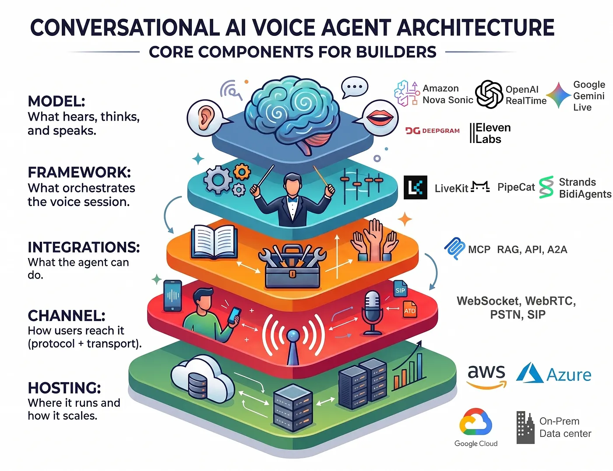

# From Stack Diagram to Working Phone Call: Building Voice AI Agents with the Conversational AI Agent Studio

*A guided studio for designing, testing, and deploying real-time voice agents on AWS — powered by Amazon Nova 2 Sonic, Strands Agents BidiAgent, and Amazon Bedrock AgentCore.*

> **Note:** This project is a sample / proof-of-concept — a reference implementation for learning and prototyping. Review and harden it (security, error handling, scaling, cost controls) before using it for production workloads.

---

## A voice agent is a stack, not a model

In a previous post — [Building Real-Time Voice Agents: Choosing Models, Frameworks, Protocols, and Hosting](https://medium.com/generative-ai/building-real-time-voice-agents-choosing-models-frameworks-protocols-and-hosting-5dc0a28f98e2) — we argued that a real-time voice agent isn't one model you drop in. It's a stack of decisions, and each layer shapes the ones around it.

The layers, top to bottom:

- **Model** — what hears, thinks, and speaks. Either a single speech-to-speech model (like Amazon Nova 2 Sonic) or a cascade of STT → LLM → TTS.
- **Framework** — what orchestrates the live session: streaming, turn detection, interruptions, and tool calls (Strands BidiAgent, LiveKit, Pipecat).
- **Integrations** — what the agent can actually *do*: knowledge bases and RAG, APIs, MCP tools, other agents.
- **Channel** — how callers reach it: the protocol and transport (WebSocket in the browser, or PSTN/SIP over the phone network).
- **Hosting** — where it runs and how it scales: a managed runtime, containers, or on-prem.

That framing is useful for reasoning about trade-offs — but every builder eventually hits the same wall: *assembling the stack by hand is a lot of undifferentiated work.* You wire a model to a framework, bolt on tools, stand up a transport, presign credentials, host it somewhere, and only then can you hear the agent say "hello."

The **Conversational AI Agent Studio** is what happens when you turn that stack into a guided workflow.

## What the studio does

The studio lets you go from an industry template to a live phone call without hand-assembling any of the layers above. You pick a model and voice, write (or generate) a prompt, attach tools and RAG, design a conversation flow, test it live in the browser, evaluate it against simulated callers, and — when you're ready — connect it to a real phone number.

Under the hood, the current build resolves the stack to a specific, opinionated set of choices:

- **Model:** Amazon Nova 2 Sonic (speech-to-speech)
- **Framework:** Strands Agents BidiAgent
- **Hosting:** Amazon Bedrock AgentCore Bidirectional Runtime
- **Channel:** browser WebSocket, plus optional PSTN (Twilio) and SIP telephony

The solution is four deployable components. The core app — the React UI, the demos/tools/RAG API, and the Nova Sonic voice agent on AgentCore — is deployed by a single CDK command. The two telephony paths are deployed independently, because they provision internet-facing network infrastructure (public load balancers, open UDP ports) that deserves a higher security review bar than the rest of the solution.

| # | Component | How it's deployed |
|---|-----------|-------------------|
| 1 | Frontend app (React UI + demos/tools/RAG API, Cognito) | CDK — `deploy.sh` |
| 2 | Voice agent on AgentCore (Nova Sonic BidiAgent runtime) | CDK — `deploy.sh` |
| 3 | PSTN relay (Twilio TAC bridge) | Independent (`telephony/pstn/`) |
| 4 | SIP relay (drachtio + bridge) | Independent (`telephony/sip/`) |

## Walking the stack, one layer at a time

### Model + Framework: Nova Sonic on Strands BidiAgent

The agent runtime builds a **Strands BidiAgent** wired to **Amazon Nova 2 Sonic**. Nova Sonic is a single speech-to-speech model — audio goes in, audio comes out, no intermediate text step — which is the lowest-latency approach to a natural voice conversation. Strands BidiAgent handles the hard real-time parts: bidirectional WebSocket streaming, turn detection, barge-in, and tool orchestration.

Speech-to-speech is the pipeline that's implemented today. (The wizard also surfaces OpenAI Realtime and Gemini Live as model choices, and has scaffolding for a cascaded STT → LLM → TTS pipeline, but those aren't wired to a backend yet — the running agent is Nova Sonic.)

### Integrations: tools, MCP, sub-agents, and RAG

An agent that can only talk isn't very useful. The studio lets you give an agent capabilities without redeploying it:

- **Reserved tools** — every agent can gracefully end a call or transfer to a human.
- **Custom tools** — define a tool in the UI with a name, description, parameters, and a mock response. Great for prototyping a flow before the real backend exists.
- **Integrations** — connect tools to real HTTP webhooks, Lambda functions, AgentCore MCP gateways, or other AgentCore runtimes acting as sub-agents.
- **RAG** — point the agent at an existing Amazon Bedrock Knowledge Base, upload documents, and let it retrieve grounded answers during a conversation.

Because tools are configured as data (not code baked into the runtime), you can iterate on an agent's behavior entirely from the UI.

### Channel: from browser to phone

Every agent is testable in the browser over a WebSocket the moment you build it. But real voice agents need phones, so the studio ships two telephony paths — and their designs are a good illustration of how the *Channel* layer forces architectural decisions.

**PSTN (Twilio).** Callers dial a Twilio number and reach the same agent that runs in the browser; multiple agents can even share one number via a DTMF menu. Twilio handles all the RTP and codec complexity and hands the bridge audio over a WebSocket. The result is a small security surface: ECS Fargate behind an ALB and CloudFront, HTTPS/WSS only, no open UDP ports.

**SIP (direct trunk).** For enterprise contact centers (Genesys, Five9, NICE) or Twilio SIP Trunking, the studio runs a self-managed **drachtio + Node.js bridge** that terminates SIP and handles raw RTP media directly (converting μ-law 8 kHz ↔ PCM 16 kHz). Lower latency, but a larger surface: it needs EKS with `hostNetwork` and an NLB, because RTP requires the server to be directly addressable on a public IP — a NAT gateway can't forward inbound UDP.

| | PSTN Relay | SIP Relay |
|---|---|---|
| Media | WebSocket (Twilio manages RTP) | Raw UDP/RTP (self-managed) |
| Infrastructure | ECS Fargate + ALB + CloudFront | EKS + NLB (UDP) |
| Open ports | None (HTTPS only) | UDP 5060 + 20000–20100 |
| Best for | Quick phone testing | Enterprise CCaaS, lowest latency |

That contrast — same agent, two very different network footprints — is exactly the kind of trade-off the stack framing predicts.

### Hosting: a managed bidirectional runtime

The agent runs on **Amazon Bedrock AgentCore's Bidirectional Runtime**, which is purpose-built for persistent, streaming voice sessions. The browser (and each telephony bridge) connects to it over a **SigV4-presigned WebSocket**, with credentials derived from an authenticated Amazon Cognito session — no long-lived AWS keys sitting in the frontend. The whole core app deploys with one CDK command.

## The part most demos skip: evaluation

Building a voice agent is easy to demo and hard to trust. Prompts drift, models change, and "it worked when I tried it" isn't a quality bar. So the studio treats **evaluation as a first-class feature.**

You define an **eval suite** — a set of reusable test cases, each with a prompt, a target model, and a simulated-caller scenario. When you run it, the studio drives a full conversation between a simulated user and your agent, then scores the transcript with an **LLM-as-judge** against configurable aspects and rubrics, producing PASS/FAIL verdicts *with reasoning*, an overall pass rate, and a list of strengths and weaknesses.

Crucially, you can run each test with **real or mock tools** — exercise the true HTTP/Lambda/MCP integrations, or swap in mock responses to test conversation logic in isolation. And every run captures voice-latency metrics that matter for real-time UX:

| Metric | What it measures |
|--------|------------------|
| TTFT | Time to first token — how fast the agent starts "thinking" |
| TTFB | Time to first audio byte — how fast the caller hears a response |
| Tool execution | How long each tool call takes |

Each is aggregated as min / max / avg / p50 / p95, so you can catch a regression before your callers do.

This is where the eval loop pays off: because the judge explains *why* a run failed, a FAIL is actionable. In one of our own test runs, the judge correctly flagged that an agent kept trying to transfer to a human instead of authenticating — because the test suite's agent hadn't been given an authentication tool. The eval didn't just say "bad"; it told us exactly what to fix.

## Who it's for

- **Solution builders and SAs** who want to stand up a credible voice-agent demo on AWS in an afternoon, then customize it per industry.
- **Developers** evaluating Nova Sonic, Strands BidiAgent, and AgentCore who'd rather start from a working reference than a blank repo.
- **Teams** who need to *measure* voice-agent quality — latency and goal completion — not just eyeball a demo.

## Try it

The core app deploys with a single CDK command; the deployment guide covers prerequisites, stacks, IAM, and the one manual step for the eval runner bundle. Telephony is optional and deployed separately when you're ready to make real calls.

Start from the [project README](../README.md), then follow [docs/DEPLOYMENT.md](DEPLOYMENT.md). For the concepts behind the layers, revisit [Building Real-Time Voice Agents: Choosing Models, Frameworks, Protocols, and Hosting](https://medium.com/generative-ai/building-real-time-voice-agents-choosing-models-frameworks-protocols-and-hosting-5dc0a28f98e2).

*The studio is licensed MIT-0. It's a starting point — take it apart, swap layers, and make it yours.*
