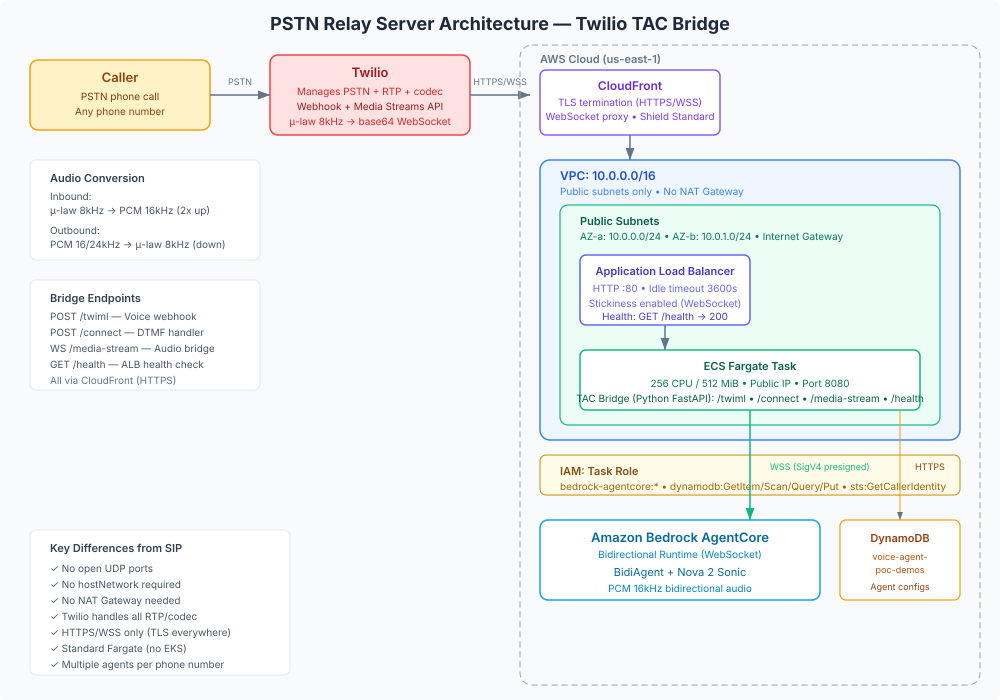

# PSTN Relay Server Design Guide

Twilio-based PSTN relay server (TAC Bridge) that bridges inbound phone calls to the Nova Sonic voice agent on Amazon Bedrock AgentCore. Callers dial a Twilio number and talk to the same AI agent available in the browser.

## Architecture Diagram



## Overview

Twilio handles the phone network (PSTN termination, RTP media, call routing). The TAC Bridge is a lightweight WebSocket relay that:
1. Receives a webhook when a call arrives (TwiML response)
2. Receives audio from Twilio via Media Streams (WebSocket with μ-law 8kHz base64)
3. Converts audio format and forwards to AgentCore (PCM 16kHz)
4. Receives agent responses from AgentCore and sends back to Twilio

Unlike the SIP relay (which manages raw UDP/RTP), this approach lets Twilio handle all media transport complexity. The bridge only processes WebSocket messages — no UDP ports, no SDP negotiation, no codec transcoding at the network layer.

## Call Flow

```
1. Caller dials Twilio phone number
2. Twilio → POST /twiml (webhook) → bridge returns TwiML
3. If multiple agents on this number: TwiML plays DTMF menu (press 1 for X, 2 for Y)
4. Caller presses digit → POST /connect → bridge pre-warms AgentCore
5. TwiML <Connect><Stream> → Twilio opens WebSocket to wss://.../media-stream
6. Bridge → presign WSS URL → connect to AgentCore
7. Bridge → sessionConfig (voice, prompt, tools) → AgentCore
8. AgentCore → "ready" → bridge (session warm)
9. Twilio → base64 μ-law 8kHz audio frames → bridge
10. Bridge → decode μ-law, upsample 8→16kHz → AgentCore
11. AgentCore → PCM 16kHz → bridge → downsample, encode μ-law → Twilio
12. Caller hangs up → Twilio stream stop event → bridge → sessionEnd → AgentCore
```

### Pre-warming

When a DTMF menu is presented, the bridge pre-warms the AgentCore connection in parallel (during the time the caller is listening to options). By the time Twilio opens the media stream, AgentCore is already initialized with the selected demo's config. This eliminates cold-start latency.

## Network Architecture

### Why This Is Simpler Than SIP

| Concern | SIP Relay | PSTN Relay (TAC Bridge) |
|---------|-----------|------------------------|
| Media transport | Raw UDP (RTP packets) | WebSocket (Twilio handles RTP) |
| Public UDP ports | Yes (5060 + 20000-20100) | No |
| hostNetwork required | Yes | No |
| Subnet | Must be public (RTP needs direct IP) | Public (Fargate) — no inbound UDP |
| NAT Gateway | N/A (public subnet) | Not needed (public IP on task) |
| Security surface | Large (open UDP) | Small (HTTPS only via CloudFront) |
| Load balancer | NLB (UDP) | ALB (HTTP/WebSocket) |

### VPC Layout

```
VPC: 10.0.0.0/16
├── Public Subnet AZ-a: 10.0.0.0/24
│   ├── ALB (HTTP listener, port 80)
│   └── Fargate Task (public IP, port 8080)
│
└── Public Subnet AZ-b: 10.0.1.0/24
    └── (same, for multi-AZ ALB)

No private subnets. No NAT Gateway. (nat_gateways=0)
```

The VPC is minimal — public subnets only with `nat_gateways=0`. Fargate tasks get public IPs directly via `assign_public_ip=True`. Since all communication is outbound WebSocket (to AgentCore and Twilio), no inbound UDP exposure is needed.

### Traffic Flows

| Flow | Path | Protocol |
|------|------|----------|
| Twilio webhook | Twilio → CloudFront → ALB → Fargate (port 8080) | HTTPS/HTTP |
| Twilio Media Stream | Twilio → CloudFront → ALB → Fargate (WebSocket) | WSS/WS |
| Bridge → AgentCore | Fargate → Internet Gateway → AgentCore endpoint | WSS (SigV4) |
| Bridge → DynamoDB | Fargate → Internet Gateway → DynamoDB endpoint | HTTPS |
| Health check | ALB → Fargate `/health` | HTTP |

### CloudFront Layer

CloudFront sits in front of the ALB to provide:
- **HTTPS termination** — Twilio requires `wss://` for media streams (TLS)
- **WebSocket support** — CloudFront natively proxies WebSocket upgrade requests
- **Managed TLS certificate** — no ACM cert management on the ALB
- **DDoS protection** — AWS Shield Standard included

## Components

### Application Load Balancer

- Internet-facing, public subnets
- HTTP listener port 80 (CloudFront terminates TLS)
- Target: Fargate task port 8080
- Health check: `GET /health` (HTTP 200)
- Idle timeout: 3600s (calls can last up to 1 hour)
- Stickiness enabled (WebSocket sessions stay on same task)

### ECS Fargate Service

- Cluster: `voice-agent-tac-bridge`
- Task: 256 CPU / 512 MiB memory (lightweight — just WebSocket relay)
- Desired count: 1 (scale up for concurrent call capacity)
- Public IP assigned (for outbound internet to AgentCore)
- No `hostNetwork` needed — standard Fargate networking
- Deployment circuit breaker with rollback enabled

### TAC Bridge Container (Python FastAPI)

| Endpoint | Method | Purpose |
|----------|--------|---------|
| `/twiml` | POST/GET | Twilio voice webhook — returns TwiML (menu or direct connect) |
| `/connect` | POST | DTMF selection handler — pre-warms AgentCore, returns TwiML |
| `/media-stream` | WebSocket | Bidirectional audio bridge (Twilio ↔ AgentCore) |
| `/health` | GET | Health check for ALB |

### DynamoDB Tables

| Table | Purpose |
|-------|---------|
| `voice-agent-poc-demos` | Agent configurations (voice, prompt, tools). The bridge scans this table and routes a call by matching the dialed number against each demo's `config.telephony.phoneNumber`. |

The bridge does not use a separate phone-mappings table — number → agent routing
is derived from the demo configs' `telephony.phoneNumber` field.

### IAM: Task Role

```
bedrock-agentcore:*                → Presign WebSocket URLs, invoke runtime
dynamodb:GetItem/Scan               → Read demo configs from voice-agent-poc-demos
sts:GetCallerIdentity              → SigV4 presigning
```

## Audio Pipeline

### Inbound (caller → agent)

```
Twilio Media Stream event: {"event": "media", "media": {"payload": "<base64 μ-law>"}}
  → base64 decode (160 bytes per 20ms frame)
  → decode μ-law to PCM 16-bit signed (320 bytes)
  → upsample 8kHz → 16kHz (640 bytes)
  → base64 encode
  → WebSocket JSON: {"type": "bidi_audio_input", "audio": "...", "sample_rate": 16000}
  → AgentCore
```

### Outbound (agent → caller)

```
AgentCore WebSocket: {"type": "bidi_audio_stream", "audio": "<base64 PCM 16kHz>"}
  → base64 decode
  → downsample 16kHz → 8kHz
  → encode to μ-law
  → base64 encode
  → Twilio Media Stream: {"event": "media", "streamSid": "...", "media": {"payload": "..."}}
```

### Barge-in (interruption)

When AgentCore sends `bidi_interruption`, the bridge sends a `clear` event to Twilio:
```json
{"event": "clear", "streamSid": "..."}
```
This immediately stops playback of queued agent audio on Twilio's side.

## Multi-Agent Support (DTMF Menu)

Multiple agents can share one Twilio phone number. When a call arrives:

1. Bridge queries DynamoDB for all demos with `telephonyEnabled` matching the called number
2. If 1 demo → connect directly (no menu)
3. If multiple → return TwiML `<Gather>` with DTMF options ("Press 1 for Insurance Claims, Press 2 for Banking...")
4. Caller presses digit → bridge pre-warms AgentCore with that demo's config
5. TwiML connects the media stream with the selected demo ID

## Deployment

The PSTN relay is deployed separately from the main CDK app. See
[`telephony/pstn/README.md`](../telephony/pstn/README.md) for the full self-managed
deployment instructions (phone-mappings table, image build, ECS Fargate + ALB +
CloudFront topology, IAM).

Post-deploy — configure Twilio: set your phone number's Voice webhook (POST) to
`https://<your-cloudfront-domain>/twiml` (the public HTTPS domain from your
deployment).

In [Twilio Console](https://console.twilio.com):
- Phone Numbers → select your number
- Voice Configuration → "A call comes in" → Webhook → paste the URL (POST)

## Security — Production Recommendations

The PSTN relay has a smaller attack surface than the SIP relay (no open UDP ports), but still warrants hardening for production.

### Threat Model

- **Webhook spoofing** — attacker calls `/twiml` directly to enumerate agent configs
- **WebSocket abuse** — unauthorized connections to `/media-stream`
- **DDoS** — flood the ALB with requests
- **Data exposure** — agent configs/prompts readable via DynamoDB access

### Priority 1: Twilio Request Validation

Validate that webhook requests actually come from Twilio using their signature header:

```python
from twilio.request_validator import RequestValidator

validator = RequestValidator(TWILIO_AUTH_TOKEN)
is_valid = validator.validate(url, params, signature_header)
```

This cryptographically proves the request originated from Twilio. Reject all others with 403.

### Priority 2: CloudFront WAF

Attach AWS WAF to the CloudFront distribution:
- Rate limiting (block IPs exceeding N requests/minute)
- IP allowlisting for the webhook endpoint (Twilio publishes their IP ranges)
- Geographic restriction if your service is region-specific

### Priority 3: WebSocket Authentication

Currently `/media-stream` is unauthenticated. Options:
- Require a token in the WebSocket URL query string (generated per-call in TwiML)
- Validate that the `streamSid` in the first message matches a known active call
- Reject connections not preceded by a valid `/twiml` webhook

### Priority 4: Secrets Management

Move Twilio credentials from environment variables to AWS Secrets Manager:
- `TWILIO_AUTH_TOKEN`
- `TWILIO_API_KEY` / `TWILIO_API_SECRET`

Reference secrets in the ECS task definition with `secrets` (not `environment`).

### Priority 5: Network Isolation

| Improvement | Benefit |
|-------------|---------|
| VPC Gateway Endpoint for DynamoDB | Keeps DB traffic off public internet |
| Security group: restrict ALB to CloudFront IPs | Prevent direct ALB access |
| ALB access logs enabled | Audit trail for webhook calls |
| CloudWatch alarms | Alert on error rate spikes |

### Priority 6: Scaling and Resilience

| Item | Current | Production |
|------|---------|------------|
| Desired count | 1 | Auto-scaling (based on concurrent connections) |
| Multi-AZ | ALB yes, task single AZ | Spread tasks across AZs |
| Circuit breaker | Enabled | Enabled (with CloudWatch alarm) |
| Task memory | 512 MiB | Monitor and right-size (each call ~5-10 MiB) |

### Hardening Checklist

| Item | Dev (current) | Production |
|------|---------------|------------|
| Webhook validation | None | Twilio signature verification |
| WebSocket auth | None | Per-call token or streamSid validation |
| WAF | None | CloudFront WAF (rate limit + IP allowlist) |
| Twilio credentials | Env vars | Secrets Manager |
| DynamoDB access | Internet Gateway | VPC Gateway Endpoint |
| ALB access | Public | CloudFront-only (prefix list SG) |
| Logging | CloudWatch Logs | + ALB access logs + structured JSON |
| Scaling | Fixed count (1) | Target tracking auto-scaling |
| TLS | CloudFront managed | CloudFront managed (no change needed) |

## Comparison: PSTN Relay vs SIP Relay

| | PSTN (TAC Bridge) | SIP (Direct) |
|---|---|---|
| Provider | Twilio (manages PSTN + RTP) | Any SIP trunk |
| Media handling | WebSocket (Twilio abstracts RTP) | Raw UDP/RTP (self-managed) |
| Infrastructure | ECS Fargate (serverless-like) | EKS with hostNetwork |
| Open ports | None (HTTPS only via CloudFront) | UDP 5060 + 20000-20100 |
| Agents per number | Multiple (DTMF selection) | One per trunk |
| Latency | Higher (Twilio relay in path) | Lower (direct RTP) |
| Security surface | Small | Large (open UDP) |
| Enterprise CCaaS | Via Twilio SIP Trunk | Direct (Genesys, Five9) |
| Scaling | Fargate auto-scaling | EKS node scaling |
| Cost | Twilio per-minute + Fargate | EKS + EC2 (no per-minute) |

## Related Documentation

- [GUIDE-sip-server.md](GUIDE-sip-server.md) — SIP relay server (direct trunk integration)
- [GUIDE-connect-integration.md](GUIDE-connect-integration.md) — Amazon Connect integration
- [DEPLOYMENT.md](DEPLOYMENT.md) — CDK deployment guide
