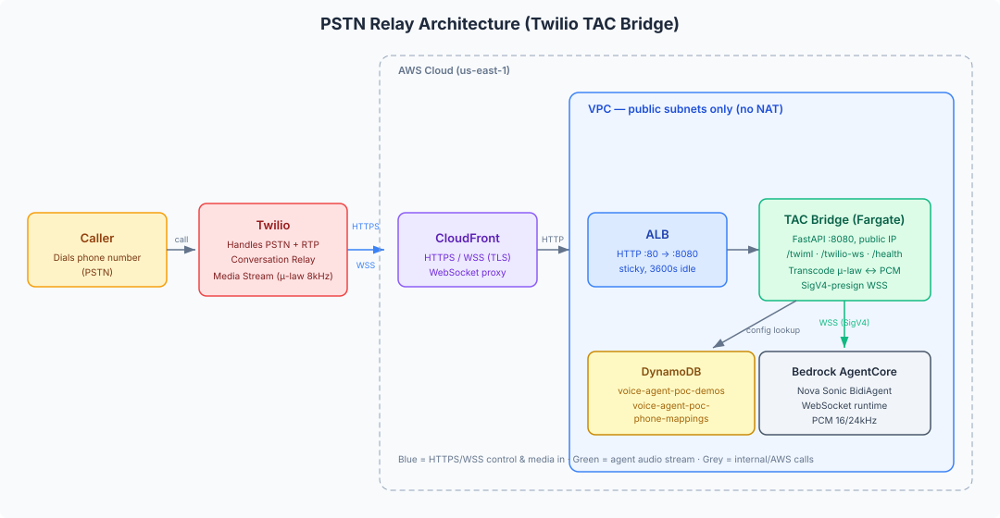

# Telephony — PSTN Relay (Twilio TAC Bridge)

Standalone PSTN relay that bridges inbound phone calls to the Nova Sonic voice
agent on Amazon Bedrock AgentCore. Callers dial a Twilio number and talk to the
same agent available in the browser.

> **This component is intentionally kept out of the main CDK deployment.**
> It provisions internet-facing network infrastructure (a public load balancer
> and a container with a public IP), which is subject to a higher security
> review bar than the rest of the solution. Deploy it separately, on your own
> account, following the instructions below and the hardening guidance in
> [`docs/GUIDE-pstn-relay-server.md`](../../docs/GUIDE-pstn-relay-server.md).

## Dependencies on the main solution (read this first)

Although the bridge is deployed separately, at runtime it depends on three
resources owned by the main solution. **Deploy the bridge into the same AWS
account and region as the main solution** (or set up cross-account access to the
resources below). Cross-account is possible but not covered here.

| Dependency | Why the bridge needs it | Access required |
|------------|-------------------------|-----------------|
| **Bedrock AgentCore runtime** (`VoiceAgentAgentStack` → `AgentRuntimeArn`) | The bridge presigns a SigV4 WebSocket to this runtime to reach the agent. This dependency is **unavoidable** — the runtime is where the agent runs. | `bedrock-agentcore:InvokeAgentRuntime*` + `sts:GetCallerIdentity` |
| **`voice-agent-poc-demos` DynamoDB table** | The bridge reads the agent's config (voice, prompt, tools) to build the session sent to AgentCore. | `dynamodb:GetItem`, `dynamodb:Scan` |
| **`voice-agent-poc-phone-mappings` DynamoDB table** | Maps the dialed number → agent, so the bridge routes the call to the right agent (and builds the DTMF menu when a number serves multiple agents). This table is written by the web UI's **Phone Numbers** page. | `dynamodb:GetItem`, `dynamodb:Scan` |
| **`voice-agent-poc/pstn` Secrets Manager secret** | Holds the bridge's own configuration (runtime ARN, region, public domain), written by `configure.sh`. | `secretsmanager:GetSecretValue` |

Because the phone-number → agent mapping lives in the main account's DynamoDB
(written from the UI), a call can only be routed to a number you configured in
the UI if the bridge can read that same table. In practice this means: **run the
bridge in the same account as the deployed solution.** A bridge in a different
account will read a different (empty) table and won't find your mappings.

The bridge's IAM role/task therefore needs the combined permissions in the table
above, scoped to those specific resource ARNs.

## Architecture



## Contents

| File | Purpose |
|------|---------|
| `tac_server.py` | FastAPI app — Twilio Media Streams ↔ AgentCore audio bridge |
| `Dockerfile` | Container image (`python:3.12-slim`, runs uvicorn on port 8080) |
| `requirements.txt` | Python dependencies |

## How it works

Twilio handles the phone network (PSTN termination, RTP, routing). The bridge is
a lightweight WebSocket relay:

1. Twilio POSTs `/twiml` on an inbound call; the bridge returns TwiML.
2. Twilio opens a Media Stream WebSocket to `/twilio-ws` (μ-law 8kHz base64).
3. The bridge presigns a WSS URL (SigV4) and connects to AgentCore.
4. Audio is transcoded both ways (μ-law 8kHz ↔ PCM 16/24kHz) and relayed.

For the full call flow, audio pipeline, DTMF multi-agent menu, and architecture
diagram, see [`docs/GUIDE-pstn-relay-server.md`](../../docs/GUIDE-pstn-relay-server.md).

## Configuration

Run the interactive setup script. It auto-detects the AgentCore runtime ARN,
region, and demos table from your deployed CloudFormation stacks, prompts for
the few PSTN-specific values, and stores everything as a JSON secret in AWS
Secrets Manager (`voice-agent-poc/pstn`). Nothing is written to disk.

```bash
cd telephony/pstn
./configure.sh
```

At startup the bridge loads its config from that secret when `CONFIG_SECRET_NAME`
is set; otherwise it falls back to the environment variables below (useful for
local development).

```bash
CONFIG_SECRET_NAME=voice-agent-poc/pstn AWS_REGION=us-east-1 \
  uvicorn tac_server:app --host 0.0.0.0 --port 8080
```

The bridge's IAM role/task needs `secretsmanager:GetSecretValue` on the
`voice-agent-poc/pstn` secret.

### Settings (stored in the secret, or set via env var for local dev)

| Variable | Required | Description |
|----------|----------|-------------|
| `AGENTCORE_RUNTIME_ARN` | yes | ARN of the deployed AgentCore runtime (from `VoiceAgentAgentStack` output `AgentRuntimeArn`) |
| `AWS_REGION` | yes | AWS region of the runtime and DynamoDB tables |
| `DEMOS_TABLE_NAME` | no | Agent config table (default `voice-agent-poc-demos`) |
| `TWILIO_VOICE_PUBLIC_DOMAIN` | yes | Public HTTPS domain the bridge is reachable at |
| `DEFAULT_VOICE` | no | Default Nova Sonic voice (default `tiffany`) |

Twilio credentials are **not** consumed by this bridge — Twilio calls the bridge
via its signed webhook, so there is no Twilio secret to store here.

The bridge reads agent configurations from the `voice-agent-poc-demos` DynamoDB
table and the phone-number → agent mapping from `voice-agent-poc-phone-mappings`.
**Both tables are created and owned by the main solution's `VoiceAgentDemosStack`
and are written by the web UI — the bridge only reads them.** Do not create them
here; just deploy the bridge into the same account/region so it can read them
(see "Dependencies on the main solution" above).

## Run locally

```bash
cd telephony/pstn
pip install -r requirements.txt

export AGENTCORE_RUNTIME_ARN="arn:aws:bedrock-agentcore:us-east-1:...:runtime/..."
export AWS_REGION="us-east-1"
export TWILIO_ACCOUNT_SID="AC..."
export TWILIO_AUTH_TOKEN="..."
export TWILIO_PHONE_NUMBER="+1..."

uvicorn tac_server:app --host 0.0.0.0 --port 8080
# Health check: curl http://localhost:8080/health
```

Expose it publicly for Twilio (e.g. an `ngrok http 8080` tunnel for testing),
then point your Twilio number's Voice webhook at `https://<public-host>/twiml`.

## Deploy to AWS (manual, self-managed)

Deploy this into the **same account/region as the main solution** (see
"Dependencies on the main solution" above). The `voice-agent-poc-demos` and
`voice-agent-poc-phone-mappings` tables are created and owned by the main
solution's `VoiceAgentDemosStack` — the bridge only reads them, so you do **not**
create them here.

The runtime is a single container. Any container platform that gives it a public
HTTPS endpoint works. The reference topology (previously provisioned by CDK) is:

- **ECS Fargate** service in a **public-subnet-only VPC** (no NAT gateway); task
  `256` CPU / `512` MiB, container port `8080`, public IP assigned.
- **Application Load Balancer** (internet-facing), HTTP listener on `80` → task
  `8080`, health check `GET /health`, sticky sessions, idle timeout `3600s`.
- **CloudFront** distribution in front of the ALB to provide HTTPS/`wss://`
  (Twilio requires TLS for media streams). Set `TWILIO_VOICE_PUBLIC_DOMAIN` to
  the CloudFront domain.
- **IAM task role** (read-only on the shared tables):
  `bedrock-agentcore:InvokeAgentRuntime*`, `sts:GetCallerIdentity`,
  `dynamodb:GetItem/Scan` on the `voice-agent-poc-demos` and
  `voice-agent-poc-phone-mappings` tables, and `secretsmanager:GetSecretValue`
  on the `voice-agent-poc/pstn` secret.

### 1. Build and push the image

```bash
cd telephony/pstn
ACCOUNT=$(aws sts get-caller-identity --query Account --output text)
REPO="$ACCOUNT.dkr.ecr.$AWS_REGION.amazonaws.com/voice-agent-poc-tac-bridge"

aws ecr describe-repositories --repository-names voice-agent-poc-tac-bridge --region "$AWS_REGION" \
  || aws ecr create-repository --repository-name voice-agent-poc-tac-bridge --region "$AWS_REGION"

aws ecr get-login-password --region "$AWS_REGION" | docker login --username AWS --password-stdin "$REPO"
docker build --platform linux/amd64 -t "$REPO:latest" .
docker push "$REPO:latest"
```

(No Docker locally? Build with AWS CodeBuild in privileged mode and push to the
same ECR repo.)

### 2. Deploy the service

Deploy the image behind an ALB + CloudFront with the topology above, using your
organization's approved IaC/pipeline. Provide the environment variables from the
configuration table (with the CloudFront domain as `TWILIO_VOICE_PUBLIC_DOMAIN`).

### 3. Configure Twilio

In the [Twilio Console](https://console.twilio.com): Phone Numbers → your number
→ Voice → "A call comes in" → Webhook (POST):

```
https://<cloudfront-domain>/twiml
```

## Security

The relay exposes a public HTTPS endpoint. Before production use, review the
threat model and hardening checklist (Twilio request-signature validation,
WebSocket auth, CloudFront WAF, secrets in Secrets Manager, DynamoDB VPC
endpoint) in [`docs/GUIDE-pstn-relay-server.md`](../../docs/GUIDE-pstn-relay-server.md).

## Related docs

- [`docs/GUIDE-pstn-relay-server.md`](../../docs/GUIDE-pstn-relay-server.md) — design, architecture, security
- [`docs/SETUP-twilio-sip.md`](../../docs/SETUP-twilio-sip.md) — Twilio setup
- [`../sip/`](../sip/) — the SIP (direct trunk) relay alternative
