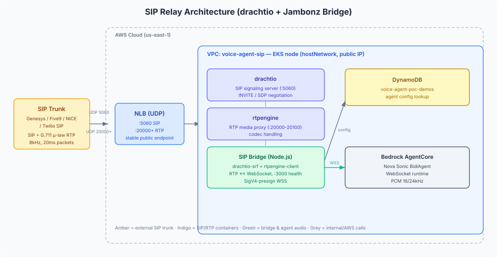

# SIP Integration — drachtio + rtpengine Voice Agent Bridge

Self-managed SIP endpoint that accepts calls from contact center platforms (Genesys, Five9, NICE) and bridges audio to the Nova Sonic voice agent.

> **Stack:** this bridge is a self-contained **drachtio-srf + rtpengine** app
> (`bridge/index.js`) — it handles the SIP INVITE and the RTP/WebSocket audio
> bridge directly. It does **not** run jambonz; there is no jambonz feature
> server, SBC, or webhook API in this repo. (Earlier revisions referred to a
> "jambonz-style" setup — the running components are drachtio + rtpengine + the
> Node.js bridge only.)

> **This component is intentionally kept out of the main CDK deployment.**
> It provisions internet-facing network infrastructure with open UDP ports
> (SIP `5060` and RTP `20000-20100`), which is subject to a higher security
> review bar than the rest of the solution. Deploy it separately, on your own
> account, following the instructions below and the hardening guidance in
> [`docs/GUIDE-sip-server.md`](../../docs/GUIDE-sip-server.md).

## Dependencies on the main solution (read this first)

Although the relay is deployed separately, at runtime it depends on three
resources owned by the main solution. **Deploy the relay into the same AWS
account and region as the main solution** (or set up cross-account access to the
resources below). Cross-account is possible but not covered here.

| Dependency | Why the relay needs it | Access required |
|------------|------------------------|-----------------|
| **Bedrock AgentCore runtime** (`VoiceAgentAgentStack` → `AgentRuntimeArn`) | The relay presigns a SigV4 WebSocket to this runtime to reach the agent. This dependency is **unavoidable** — the runtime is where the agent runs. | `bedrock-agentcore:InvokeAgentRuntime*` + `sts:GetCallerIdentity` |
| **`voice-agent-poc-demos` DynamoDB table** | The relay reads the agent's config (voice, prompt, tools) to build the session sent to AgentCore. | `dynamodb:GetItem`, `dynamodb:Scan` |
| **`voice-agent-poc-phone-mappings` DynamoDB table** | Maps the dialed number → agent so the relay routes the call to the right agent. This table is written by the web UI's **Phone Numbers** page. | `dynamodb:GetItem`, `dynamodb:Scan` |
| **`voice-agent-poc/sip` Secrets Manager secret** | Holds the relay's own configuration (runtime ARN, region, public IP, webhook secret), written by `configure.sh`. | `secretsmanager:GetSecretValue` |

Because the phone-number → agent mapping lives in the main account's DynamoDB
(written from the UI), a call can only be routed to a number you configured in
the UI if the relay can read that same table. In practice this means: **run the
relay in the same account as the deployed solution.** A relay in a different
account will read a different (empty) table and won't find your mappings.

The relay's IAM role/task therefore needs the combined permissions in the table
above, scoped to those specific resource ARNs.

## Architecture



```
Contact Center / Twilio SIP Trunk
    → SIP INVITE (UDP 5060)
    → drachtio (SIP signaling) + Node.js bridge (RTP ↔ WebSocket)
    → WebSocket audio stream
    → Nova Sonic Agent (same as browser/Twilio path)
```

## Prerequisites

- Docker & Docker Compose
- The voice agent server running on port 8081 (locally or accessible)
- For phone testing: Twilio account with a SIP Trunk

## Quick Start (Local Development)

```bash
cd telephony/sip

# Start all services (drachtio + rtpengine + bridge)
docker compose up -d

# Check status
docker compose ps
curl http://localhost:3000/health
```

The SIP endpoint is now listening on `localhost:5060`.

## Testing with a SIP Softphone

1. Install a SIP client (e.g. Linphone or Zoiper)
2. Configure it to connect to `sip:localhost:5060`
3. Dial any number — the call will be routed to your agent

## Testing with Twilio (Real Phone Number)

1. In Twilio Console → Elastic SIP Trunking → Create a Trunk
2. Under Origination:
   - Add URI: `sip:YOUR_SERVER_PUBLIC_IP:5060;transport=udp`
   - Priority: 10, Weight: 10
3. Under Numbers: Associate your Twilio phone number
4. Call the number — it routes through Twilio → SIP (drachtio) → bridge → Agent

## Configuration

### Interactive setup (recommended)

Run the setup script. It auto-detects the AgentCore runtime ARN and region from
your deployed CloudFormation stacks, prompts for the SIP-specific values, and —
importantly — generates a **random webhook secret** and stores everything as a
JSON secret in AWS Secrets Manager (`voice-agent-poc/sip`). Nothing sensitive is
written to disk.

```bash
cd telephony/sip
./configure.sh
```

At startup the bridge loads its config from that secret when `CONFIG_SECRET_NAME`
is set; otherwise it falls back to the environment variables below.

```bash
CONFIG_SECRET_NAME=voice-agent-poc/sip AWS_REGION=us-east-1 node index.js
```

The bridge's IAM role/task needs `secretsmanager:GetSecretValue` on the
`voice-agent-poc/sip` secret.

### Settings (stored in the secret, or set via env var for local dev)

| Variable | Default | Description |
|----------|---------|-------------|
| `AGENTCORE_RUNTIME_ARN` | — | ARN of the deployed AgentCore runtime |
| `AWS_REGION` | `us-east-1` | AWS region |
| `PUBLIC_IP` | — | Public IP of this server (for RTP media) |
| `AGENT_WS_URL` | `ws://host.docker.internal:8081/ws` | WebSocket URL of your Nova Sonic agent |
| `DRACHTIO_SECRET` | `cymru` | drachtio admin secret (bridge → drachtio control on 9022) |
| `PORT` | `3000` | Bridge HTTP port (serves `/health` only) |
| `LOG_LEVEL` | `info` | Logging level |

> `configure.sh` also generates and stores a `WEBHOOK_SECRET`/`DRACHTIO_SECRET`
> in the secret. The bridge only reads `DRACHTIO_SECRET`; `WEBHOOK_SECRET` is
> unused by `bridge/index.js` (it exists for optional jambonz-based setups that
> this repo does not deploy).

### No extra configuration API

There is nothing to configure after boot — the drachtio bridge handles the SIP
INVITE and the audio bridge itself. `docker compose up` starts exactly three
containers (drachtio, rtpengine, and the bridge), and the bridge exposes only a
`/health` endpoint on port `3000`. There is **no** jambonz API (port 3002), no
`call-hook`/`call-status` webhook, and no service-provider/account/application
setup step. Point your SIP trunk (or Chime Voice Connector) at the SIP endpoint
and calls flow straight through to the agent.

## Production Deployment (AWS) — self-managed

There is no CDK stack for this component. Deploy it with your organization's
approved IaC/pipeline. The reference topology (previously provisioned by the
removed `SipStack`) is:

- **VPC** with public and private-with-egress subnets (1 NAT gateway).
- **EKS cluster** (`voice-agent-sip`) with a managed node group (t3.medium,
  AL2023) labelled `role=sip`, running the bridge as a `DaemonSet` with
  `hostNetwork: true` so drachtio/rtpengine bind the node's public IP.
- **Security group / ingress** opening UDP+TCP `5060` (SIP) and UDP
  `20000-20100` (RTP) — restrict source IPs to your trunk provider in production.
- **Network Load Balancer** (internet-facing, UDP) with listeners for `5060`
  and `20000` — NLB gives a stable public endpoint; health check targets the
  bridge on TCP `3000`.
- **Node IAM role**: `bedrock-agentcore:InvokeAgentRuntime*` (SigV4 presigning)
  and `dynamodb:Scan/GetItem/Query` on `voice-agent-poc-demos`.

The container image is built from `Dockerfile.bridge` in this folder:

```bash
cd telephony/sip
ACCOUNT=$(aws sts get-caller-identity --query Account --output text)
REPO="$ACCOUNT.dkr.ecr.$AWS_REGION.amazonaws.com/voice-agent-sip-bridge"

aws ecr describe-repositories --repository-names voice-agent-sip-bridge --region "$AWS_REGION" \
  || aws ecr create-repository --repository-name voice-agent-sip-bridge --region "$AWS_REGION"

aws ecr get-login-password --region "$AWS_REGION" | docker login --username AWS --password-stdin "$REPO"
docker build --platform linux/amd64 -f Dockerfile.bridge -t "$REPO:latest" .
docker push "$REPO:latest"
```

The bridge needs `AGENT_WS_URL` (or `AGENTCORE_RUNTIME_ARN`), `AWS_REGION`, and
`DEMOS_TABLE` (default `voice-agent-poc-demos`) supplied via the pod's ConfigMap
or environment. Reference Kubernetes manifests are in [`k8s/`](k8s/).

The Chime SDK SIP media application handler in [`chime-sma/`](chime-sma/) is a
separate, manually-deployed Lambda — see
[`docs/SETUP-chime-sdk-sip.md`](../../docs/SETUP-chime-sdk-sip.md).

## Security

The SIP relay exposes open UDP ports to the internet. Before production use,
review the threat model and hardening guidance (source-IP restriction on the
SIP/RTP ports, drachtio secret rotation, TLS/SRTP, rate limiting) in
[`docs/GUIDE-sip-server.md`](../../docs/GUIDE-sip-server.md).

## Contact Center Integration

### Genesys Cloud
1. Admin → Telephony → Trunks → Create External Trunk
2. SIP Servers: `your-elastic-ip:5060`
3. Create an Architect flow that routes to this trunk

### Five9
1. VCC Admin → SIP → Trunks → Add
2. Termination URI: `sip:your-elastic-ip:5060`
3. Route campaigns/skills to the trunk

### NICE CXone
1. Studio → SIP Transfer action
2. Destination: `sip:agent@your-elastic-ip:5060`
3. Add custom headers for context passing

## Troubleshooting

```bash
# Check SIP connectivity
docker compose exec drachtio nc -zv localhost 5060

# View bridge logs
docker compose logs -f sip-bridge

# View SIP signaling
docker compose logs -f drachtio

# Test with SIP OPTIONS ping
sipgrep -p 5060
```
